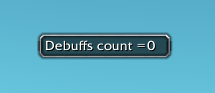
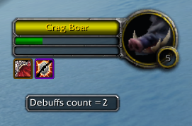

# FVP_TEST_CheckDebuffs v2
### ⚠ This is NOT a real addon, for TEST ONLY ⚠
---
### Installation:
1. [Download](/../../archive/refs/heads/main.zip) and open addon archive
2. Copy folder `FVP_TEST_CheckDebuffs` to addons folder `... \ VanillaPlus \ Interface \ AddOns \`
---
### Description:
The addon is a small frame that displays the maximum count of debuffs registered on the target. You can change the position of this frame on the screen using drag and drop. This maximum count of debuffs is automatically updated once per second. When you enter the game this count = 0.

Once per second, the addon reads the debuffs on your target, counts their number and displays the maximum count.

This count will remain on the screen even when you don't have a target. But this counter is not saved when you relogin or exit the game.

### Contact me on Discord  and send me the value of this counter.
